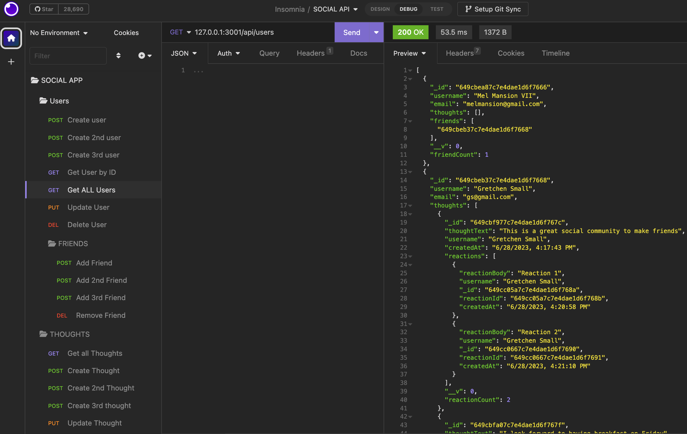

# Social App

This social network web application allows for users to create a friend list with one other, to share their thoughts and react to friends' thoughts. 

# Description

Social Network APIapp is a back-end application. This app builds a Mongo database containing two models: Users and Thoughts which store pertinent data. The mongo database is named socialmediaDB.The app uses the [Express.js](https://www.npmjs.com/package/express) package as the server back-end and [Mongoose](https://www.npmjs.com/package/mongoose) for the interface to Mongo DB. This implements NoSQL (short for "not only SQL"). NoSQL handles large volumes of unstructured or semi-structured data. To use this app, you will need a REST client for making HTTP requests. Two such development platfoms are [Insomnia](https://insomnia.rest/) and [Postman](https://www.postman.com/product/rest-client/). The video below demonstrates Insomnia. 

Insomnia is used as a REST client to seed the database and test the backend API routes. It will send HTTP requests to the app and users can view the responses. 

[](n/a)

# Git Hub Repository
https://github.com/tasshroll/friend-connect

# Screenshots

`Making a HTTP GET request to retreive all users in the database with Insomnia.`

 

## Video

[Click here for Video demonstration of social App](https://youtu.be/MUitKzEsRis)

## Table of Contents

[Installation & Usage](#installation--usage)

[Tests](#tests)

[User Story](#user-story)

[Acceptance Criteria](#acceptance-criteria)

# Installation & Usage

1. Set up the environment by installing node package manager:

	* npm i 

2. Start the server. Response is, "App listening on port 3001!"

	* node index.js

3. Enter HTTP requests in Insomnia to simulate the front-end. Insomnia is a open-source RESTful API client that allows developers to test and interact with APIs. It provides a user-friendly interface for sending HTTP requests. From insomnia, use the following endpoints to test

# Tests

## Test Social App using Insomnia

Insomnia is used to seed th data base with users and test the Socal App., Insomnia can send requests to the API endpoints and verify the responses to ensure that the frontend code interacts correctly with the backend. Review the video for CRUD operations used to modify the database.  The first task is to create  users in the database. Next is to test the user routes and add/remove friends. Thoughts can be created, updated, and deleted. Reactions to each thought can be added and removed

**Models**
* `Users Collection`

    * [USERS] POST - Create user `(/api/users)`
        ```json
        {
	    "username" : "Gretchen Small",
	    "email" : "gs@gmail.com"
        }
        ```

    * [USERS] GET – GET all users `(api/users)`

    * [USERS] PUT – Update User `(api/users/:userId)`
        ```json
        {
	    "username" : "Gretchen Small",
	    "email" : "updatedEmailHere@gmail.com"
        }
        ```

    * [USERS] DELETE – Delete User `(api/users/:userId)`

    * [USERS] [FRIENDS] POST Add Friend `(api/users/:userId/friends/:friendId)`

    * [USERS] [FRIENDS] DELETE Remove Friend `(api/users/:userId/friends/:friendId)`


* `Thoughts Collection`
    
    * [THOUGHTS] GET – Get all Thoughts `(api/thoughts)`

    * [THOUGHTS] POST – Create Thought `(api/thoughts)`
        ```json
        {
	    "thoughtText" : "Congratulations on joining this social app!",
	    "username" : "John Doe",
	    "userId" :  "649cbedc7c7e4dae1d6f766f"
        }
        ```

    * [THOUGHTS] PUT – Update a Thought `(api/thoughts/:thoughtId)`
        ```json
        {
	    "thoughtText" : "Update to Thought Text Goes Here",
	    "username" : "John Doe",
	    "userId" :  "649cbedc7c7e4dae1d6f766f"
        }
        ```

    * [THOUGHTS] GET – Find Thought by ID `(api/thoughts/:thoughtId)`

    * [THOUGHTS] DELETE – Remove a Thought `(api/thoughts/:thoughtId)`

    * [THOUGHTS] REACTIONS] POST – Create a Reaction `(api/thoughts/:thoughtId/reactions/:reactionId)`
        ```json
        {
	    "reactionBody" : "Reaction 1",
	    "username" : "Gretchen Small"
        }
        ```

    * [THOUGHTS] [REACTIONS] DELETE – Remove Reaction `(api/thoughts/:thoughtId/reactions/:reactionId)`


## User Story

```md
AS A social media startup
I WANT an API for my social network that uses a NoSQL database
SO THAT my website can handle large amounts of unstructured data
```

## Acceptance Criteria

```md
GIVEN a social network API
WHEN I enter the command to invoke the application
THEN my server is started and the Mongoose models are synced to the MongoDB database
WHEN I open API GET routes in Insomnia for users and thoughts
THEN the data for each of these routes is displayed in a formatted JSON
WHEN I test API POST, PUT, and DELETE routes in Insomnia
THEN I am able to successfully create, update, and delete users and thoughts in my database
WHEN I test API POST and DELETE routes in Insomnia
THEN I am able to successfully create and delete reactions to thoughts and add and remove friends to a user’s friend list
```

